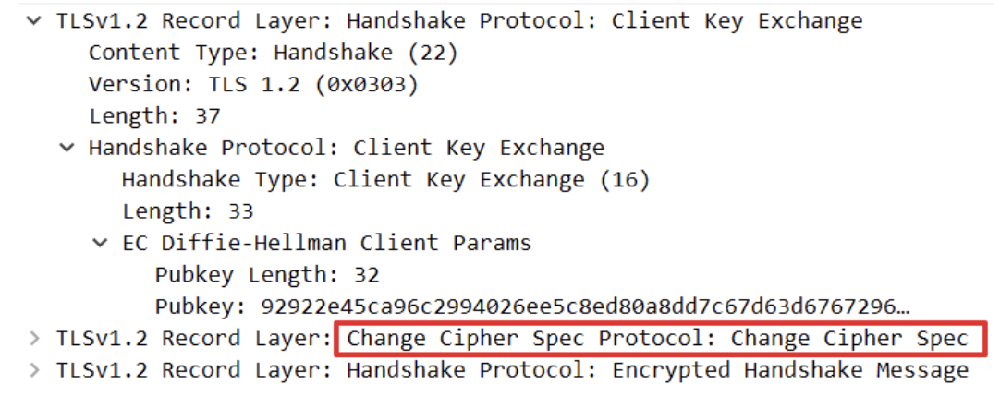

## HTTPS 통신 과정
- 암호화 알고리즘(Cipher Suite) 결정
- 일반적으로 대칭키로 통신한다. 

SSL Handshake(TLS Handshake) 

### Client Hello
Client가 Server에 연결을 시도하며 전송하는 패킷이다. 
Cipher Suite 목록, Session ID, SSL Protocol Version, Random byte 전달한다. 
*Cipher Suite는 SSL Protocol Version, 인증서 검정, 데이터 암호화 프로토콜, Hash 방식 등의 정보를 담고 있는데 Cipher Suite 알고리즘에 따라 데이터를 암호화하게 된다. 

### Cipher Suite
Client Hello에 Cipher Suite 리스트가 포함되어 있다. 

### Cipher Suite 구성

### Server Hello
Client Hello 패킷을 받아 Cipher Suite 중 하나를 선택하여 Server에게 알립니다. 
Server가 선택한 한 줄(Ciper Suite: TLS_ECDHE_RSA_WITH_AES_128_GCM_SHA256)

### Certificate
Server가 자신의 SSL 인증서를 Client에게 전달한다. 

### Server Key Exchange / Server Hello Done
Server의 공개키가 SSL 인증서 내부에 없는 경우, Server가 직접 전달한다. 

### Client Key Exchange
대칭키를 Client가 생성하여 SSL 인증서 내부에서 추출한 Server의 공개키를 이용해 암호화한 후 Server에게 전달한다. 

### Change Cipher Spec 
Client, Server 모두가 서로에게 Packet으로 교환할 정보를 교환하고 통신할 준비가 다 되었음을 알린다. 

SSL Handshake 과정을 거친 후에 Session이 연결됩니다. 
TLS HandShake는 layer 4 계층에 놓이게 됩니다. 

참고 : https://security.stackexchange.com/questions/93333/what-layer-is-tls

https://learningnetwork.cisco.com/s/question/0D53i00000Kt0q0CAB/which-layer-of-the-osi-model-do-ssl-and-tls-belong-to

https://run-it.tistory.com/30

https://aws-hyoh.tistory.com/entry/HTTPS-%ED%86%B5%EC%8B%A0%EA%B3%BC%EC%A0%95-%EC%89%BD%EA%B2%8C-%EC%9D%B4%ED%95%B4%ED%95%98%EA%B8%B0-3SSL-Handshake

https://blog.dalso.org/it/5502