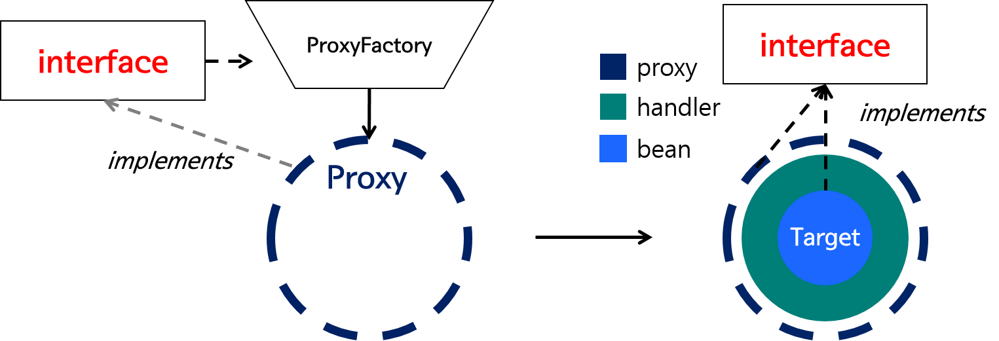
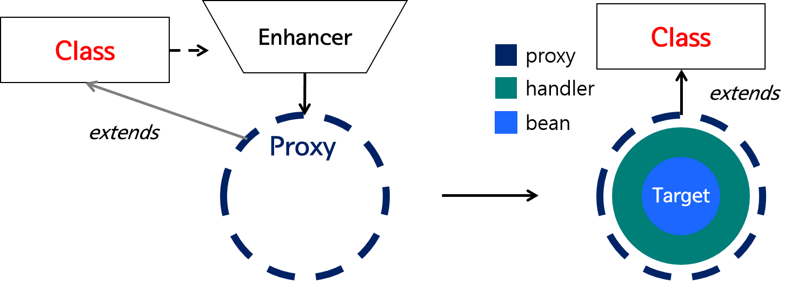
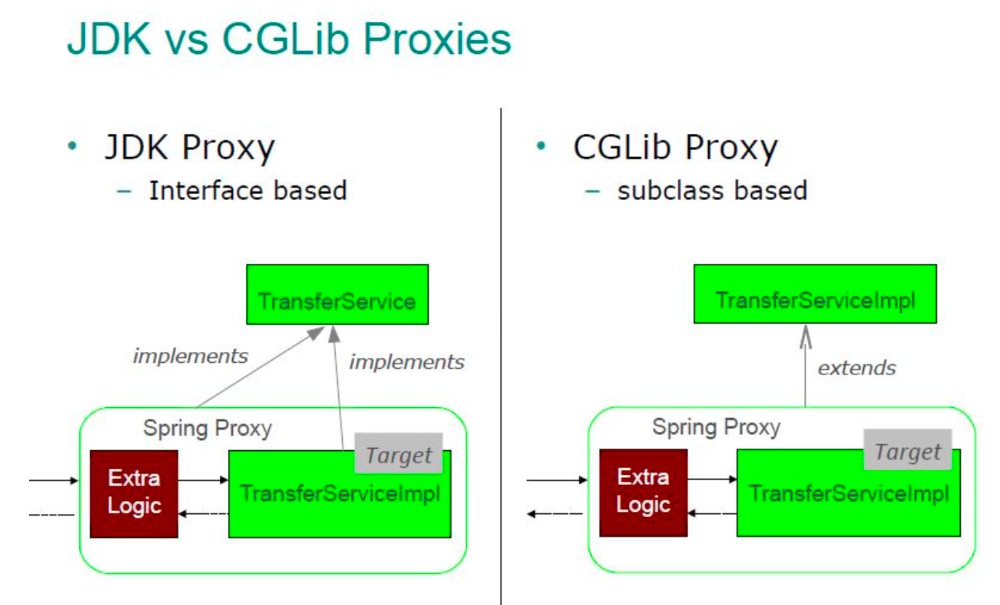

# Transactional

## 작업 단위 묶어주지 않았을 경우
- 애플리케이션 커넥션 풀을 통해서 객체를 가지고 온다. 
- 하나의 커넥션은 세션으로 처리 (별개의 작업)

## 데이터베이스 관점
- 하나의 세션으로 처리가 가능해진다. 
- 간단한 예시
```java
@Override
public Response create(Command command) {
    Connection conn = dataSource.getConnection();
    conn.setAutoCimmit(false); //원자성 고려
    try { //try-catch를 같이 쓴다. 
        ...    
        conn.commit();
    } catch (Exception e) {
        conn.rollback();
    }
        }
```
- 위와 같이 코드를 작성하면 실수가 발생할 여지가 많이 생긴다.
- 중복 코드가 많아진다. 
- 주된 관심사가 아닌 코드가 서비스 레이어가 담긴다. 
- 특정 기술에 종속적인 코드가 된다.

## 정리
- 트랜잭션 시작 -> 관심사 로직 수행 -> 커밋 또는 롤백
- 스프링에서는 Proxy 객체 도입 
- create 상속 하고 메소드를 재정의한다.
- 재정의 할때 트랜잭션 여는 코드 작성하고 원래 수행하고자하는 target 객체를 호출해서 메소드 실행 

## 질문
- 프록시 객체를 사용하는 이유?
  - 객체에 대한 접근 제어, 추가 기능 제공 
  - 객체를 직접적으로 참조하는 것이 아닌 해당 객체를 대항하는 객체를 통해 대상 객체에 접근하는 방식을 사용하면 해당 객체가 메모리에 존재하지 않아도 기본적인 정보를 참조하거나 설정할 수 있고, 실제 객체의 기능이 필요한 시점까지 객체의 생성을 미룰 수 있다.
  - 프록시 객체는 원래 객체를 감싸고 있는 객체로, 원래 객체와 타입은 동일하다. 프록시 객체가 원래 객체를 감싸서 client의 요청을 처리하게 하는 패턴이다.
- 런타임 위빙
  - 런타임 위빙(Runtime Weaving)은 주로 Aspect-Oriented Programming (AOP)에서 사용되는 개념으로, 프로그램이 실행 중인 시점(Runtime)에 특정 코드(주로 횡단 관심사를 나타내는 코드)를 기존의 클래스나 메서드에 동적으로 추가하는 과정을 의미
  -  
    - Spring AOP는 사용자의 특정 호출 시점에 IoC 컨테이너에 의해 AOP를 할 수 있는 Proxy Bean을 생성
    - Spring AOP는 런타임 위빙 방식을 기반으로 하고 있고, Spring 에서는 상황에 따라 JDK Proxy와 CGLib방식을 통해 Proxy Bean을 생성
  - JDK Proxy는 JAVA의 reflection의 Proxy클래스가 동적으로 Proxy를 생성
  - 
    - JDK Proxy가 Proxy 객체를 생성하는 방식은 다음과 같다.
    - 타겟의 인터페이스를 검증해 ProxyFactory에 의해 타겟의 인터페이스를 상속한 Proxy객체를 생성한다.
    - Proxy객체에 InvocationHandler를 포함시켜서 하나의 객체로 반환
  - final 메서드 또는 클래스에 대해서 재정의를 할 수 없기 때문에 Proxy 를 생성할 수 없어?
    - final 메서드나 클래스에 대해서 프록시를 생성할 수 없는 이유는 Java 언어의 final 키워드의 특성 때문입니다. final 키워드는 클래스, 메서드, 또는 변수가 변경되지 않도록 제한하는 역할
- spring boot 2 default proxy 는? 
  - spring boot 1.5 + 2 에서는 아래를 등록하면 jdk proxy, 그렇지 않으면 cglib proxy 인가 보넹
  ```java
  spring.aop.proxy-target-class=false
  ```

## CGLib

- CGLib는 클래스의 바이트 코드를 조작해 Proxy객체를 생성해주는 라이브러리
- Spring은 CGLib를 사용해 인터페이스가 아닌 클래스에 대해서도 Proxy를 생성해준다. CGLib는 Enhancer라는 클래스를 통해 Proxy를 생성

## @Transactional 의 동작 원리
- @Transactional은 AOP를 사용하여 구현된다. transaction 의 begin과 commit을 메인 로직 앞 뒤로 수행해주는 기능을 담당한다.
  - 스프링 프레임워크가 트랜잭션 관리를 위해 AOP 의 개념과 기술을 사용한다는 뜻
- AOP(Aspect-Oriented-Programming)
  - 여러 모듈에 걸쳐 나타나는 공통적인 기능 (로깅, 보안, 트랜잭션 관리)
- Spring boot는 프록시 객체를 생성할 때 기본적으로 CGLib를 사용한다. 그 이유는 JDK Proxy는 내부적으로 Reflection을 사용하기 때문이다. Reflection은 비용이 비싼 효율성이 떨어지는 API이고, JDK Proxy는 타겟으로 인터페이스만을 허용하기 때문
  - CGLib는 클래스의 바이트 코드를 조작해 Proxy객체를 생성해주는 라이브러리


- https://velog.io/@chullll/Transactional-%EA%B3%BC-PROXY
