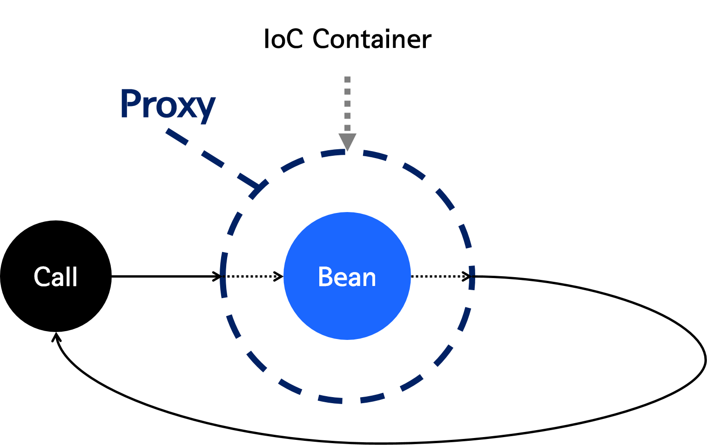

# Transactional

## 작업 단위 묶어주지 않았을 경우
- 애플리케이션 커넥션 풀을 통해서 객체를 가지고 온다. 
- 하나의 커넥션은 세션으로 처리 (별개의 작업)

## 데이터베이스 관점
- 하나의 세션으로 처리가 가능해진다. 
- 간단한 예시
```java
@Override
public Response create(Command command) {
    Connection conn = dataSource.getConnection();
    conn.setAutoCimmit(false); //원자성 고려
    try { //try-catch를 같이 쓴다. 
        ...    
        conn.commit();
    } catch (Exception e) {
        conn.rollback();
    }
        }
```
- 위와 같이 코드를 작성하면 실수가 발생할 여지가 많이 생긴다.
- 중복 코드가 많아진다. 
- 주된 관심사가 아닌 코드가 서비스 레이어가 담긴다. 
- 특정 기술에 종속적인 코드가 된다.

## 정리
- 트랜잭션 시작 -> 관심사 로직 수행 -> 커밋 또는 롤백
- 스프링에서는 Proxy 객체 도입 
- create 상속 하고 메소드를 재정의한다.
- 재정의 할때 트랜잭션 여는 코드 작성하고 원래 수행하고자하는 target 객체를 호출해서 메소드 실행 

## 질문
- 프록시 객체를 사용하는 이유?
  - 객체에 대한 접근 제어, 추가 기능 제공 
  - 객체를 직접적으로 참조하는 것이 아닌 해당 객체를 대항하는 객체를 통해 대상 객체에 접근하는 방식을 사용하면 해당 객체가 메모리에 존재하지 않아도 기본적인 정보를 참조하거나 설정할 수 있고, 실제 객체의 기능이 필요한 시점까지 객체의 생성을 미룰 수 있다.
  - 프록시 객체는 원래 객체를 감싸고 있는 객체로, 원래 객체와 타입은 동일하다. 프록시 객체가 원래 객체를 감싸서 client의 요청을 처리하게 하는 패턴이다.
- 런타임 위빙
  - 런타임 위빙(Runtime Weaving)은 주로 Aspect-Oriented Programming (AOP)에서 사용되는 개념으로, 프로그램이 실행 중인 시점(Runtime)에 특정 코드(주로 횡단 관심사를 나타내는 코드)를 기존의 클래스나 메서드에 동적으로 추가하는 과정을 의미
  -  
    - Spring AOP는 사용자의 특정 호출 시점에 IoC 컨테이너에 의해 AOP를 할 수 있는 Proxy Bean을 생성